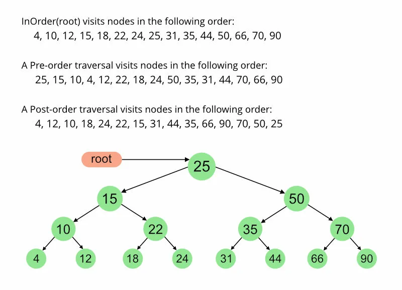

# STL-compatibleBST

> An STL-compatible container for [Binary Search Tree](https://en.wikipedia.org/wiki/Binary_search_tree) that implements various tree traversal methods [in-, pre-, post-order](https://en.wikipedia.org/wiki/Tree_traversal) through an iterator.

## Technical specification

The container is a template parameterized by the type of stored objects, the comparison operator and the allocator, as well as meets the following requirements for stl-compatible containers:

- [Container](https://en.cppreference.com/w/cpp/named_req/Container)
- [AssociativeContainer](https://en.cppreference.com/w/cpp/named_req/AssociativeContainer)
- [ReversibleContainer](https://en.cppreference.com/w/cpp/named_req/ReversibleContainer)
- [AllocatorAwareContainer](https://en.cppreference.com/w/cpp/named_req/AllocatorAwareContainer)
- [BidirectionalIterator](https://en.cppreference.com/w/cpp/named_req/BidirectionalIterator)

The tree traversal method is implemented through an iterator, and the "++" operator should move the iterator to the next element in the tree, according to the traversal rule.

## Traversals example

## Features

- STL-compatible, so std:: methods like find, sort, etc. are working with my container
- Used [Tag Dispatch Idiom](https://en.wikibooks.org/wiki/More_C%2B%2B_Idioms/Tag_Dispatching)
- Without extra memory space
